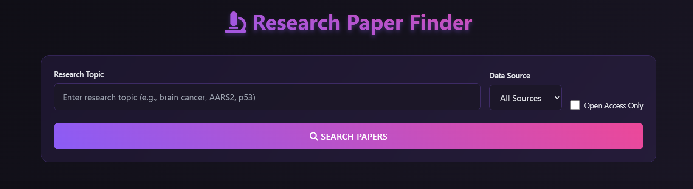

# Research Paper Finder with AI Hypothesis Generation

<div align="center">
  
 
</div>

---

## 🎯 Overview

A web application for researchers to discover scientific papers and generate AI-powered hypotheses based on their content. It integrates PubMed and EuropePMC APIs for seamless paper retrieval and offers tools for visualizing concept connections.

## ✨ Features

- 🔍 Search papers from PubMed and EuropePMC databases
- 🧠 AI-powered hypothesis generation using paper titles and abstracts
- 📊 Interactive knowledge graph to visualize key concepts
- 📥 Export results in TXT, CSV, and PDF formats
- 🎨 Modern, responsive UI with a dark theme
- 🔗 Direct links to original papers

## 🛠️ Technologies Used

### Frontend
- **HTML5**: Semantic markup
- **CSS3**: Modern styling
- **JavaScript**: Dynamic functionality

### Libraries & Frameworks
- **[Tailwind CSS](https://tailwindcss.com/)**: Utility-first CSS framework
- **[D3.js](https://d3js.org/)**: Data visualization library
- **[jsPDF](https://parall.ax/products/jspdf)**: PDF generation

### APIs
- **[PubMed E-utilities](https://www.ncbi.nlm.nih.gov/books/NBK25501/)**: PubMed database access
- **[EuropePMC REST API](https://europepmc.org/RestfulWebService)**: European research papers

## 🚀 Installation

No installation required! The app runs directly in the browser.

1. Clone the repository:
   ```bash
   git clone https://github.com/Akshay-gurav-31/AARS2.git
